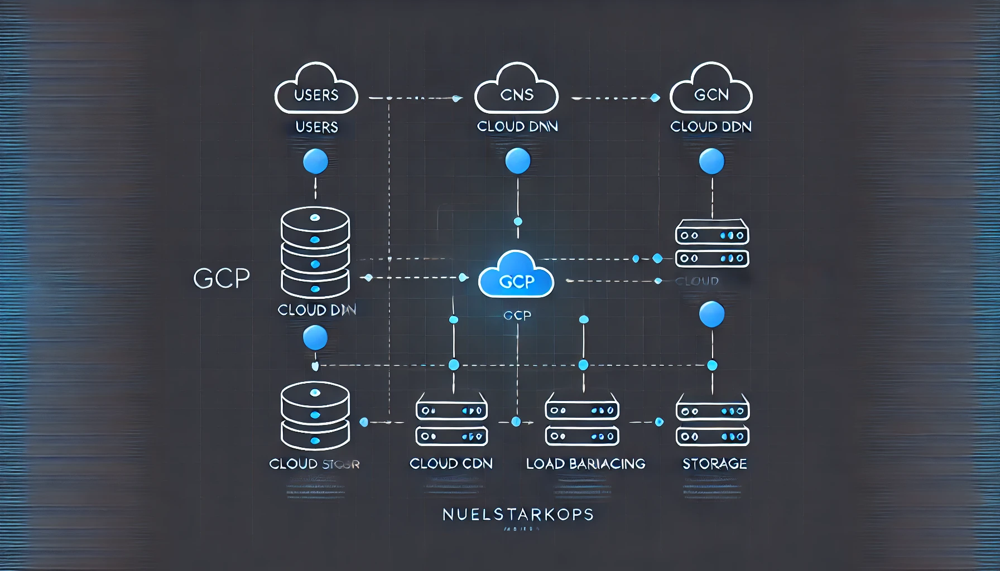

# Static Website Deployment on Google Cloud Platform (GCP) using Terraform

## Overview
This project automates the deployment of a static website on Google Cloud Platform (GCP) using Terraform. The website is hosted in a Google Cloud Storage bucket, served via a CDN-enabled backend, and secured with an HTTPS certificate. A global load balancer is used to route traffic to the bucket.

## Infrastructure Components
- **Google Cloud Storage**: Stores the static website files.
- **Cloud CDN**: Improves performance by caching content closer to users.
- **Google Cloud Load Balancer**: Distributes traffic efficiently.
- **Managed SSL Certificate**: Enables HTTPS for secure access.
- **Google Cloud DNS**: Manages domain resolution.
- **Terraform**: Automates the deployment of resources.

---

## Architecture


---

## Prerequisites
Ensure you have the following installed and configured:
- [Google Cloud SDK](https://cloud.google.com/sdk/docs/install)
- [Terraform](https://developer.hashicorp.com/terraform/downloads)
- A GCP project with billing enabled
- A registered domain name (for SSL setup)
- A service account key with required permissions

---

## Setup & Deployment

### 1. Clone the Repository
```sh
 git clone <repo_url>
 cd <repo_name>
```

### 2. Authenticate with GCP
Ensure you have a valid service account JSON key and authenticate:
```sh
export GOOGLE_APPLICATION_CREDENTIALS="./path/tocredentials.json"
gcloud auth activate-service-account --key-file=$GOOGLE_APPLICATION_CREDENTIALS
```

### 3. Initialize Terraform
```sh
terraform init
```

### 4. Plan the Deployment
```sh
terraform plan
```

### 5. Apply the Configuration
```sh
terraform apply -auto-approve
```
This command provisions the required resources on GCP.

---

## File Structure
```
├── provider.tf         # GCP provider configuration
├── main.tf             # Storage bucket and website object
├── lb.tf               # Load balancer setup
├── ssl.tf              # SSL certificate configuration
├── variables.tf        # Input variables for Terraform
├── terraform.tfvars    # Project-specific variable values
└── website/            # Directory containing the static HTML files
```

---

## Verification & Access
### Get the Public IP of the Load Balancer
```sh
gcloud compute addresses describe website-lb-ip --global
```
Copy the provided IP and access your website in a browser:
```
http://<your-ip>
```
If using a domain, ensure your DNS records are properly set up and SSL is active:
```
https://xyz.<your-domain>
```

---

## Cleanup
To remove all provisioned resources:
```sh
terraform destroy -auto-approve
```

---

## Troubleshooting
- **Website not loading?**
  - Ensure bucket objects have public access.
  - Verify DNS propagation.
  - Check Terraform logs for errors.
- **SSL certificate pending?**
  - Certificates may take time to be issued (~15 minutes).
  - Ensure domain verification is completed in Cloud DNS.

---

## Author
[Nuel Nwokeocha](https://github.com/nuelStarkOps)